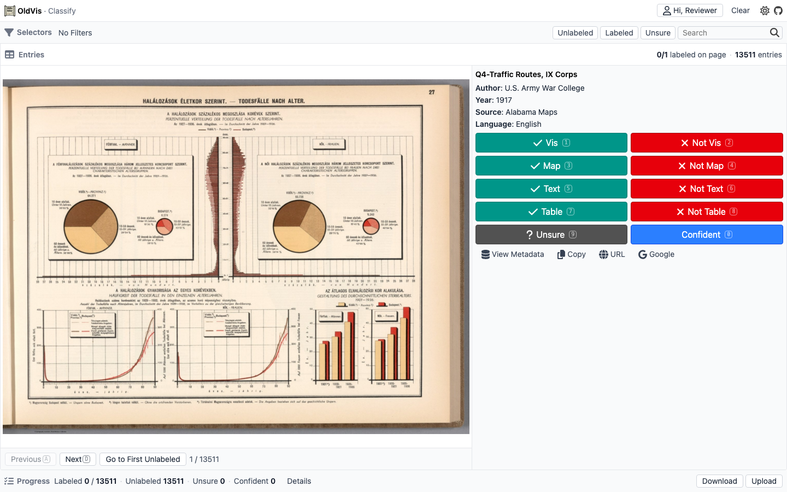

<p align="center">
  <a href="https://pnpm.io/"></a>
  <a href="https://vuejs.org/"></a>
  <a href="./LICENSE"></a>
</p>

# OldVis Image Classification Labeler

A web app for classifying old charts and figures. Assign Vis / Map / Text / Table labels (and confidence), filter the catalog, and move through entries quickly. Work stays in your browser — no server database needed.

[Live demo](https://oldvis.github.io/image-classification-labeler/)

## Features

- **Classification pairs**: Vis / Not Vis, Map / Not Map, Text / Not Text, Table / Not Table, plus Unsure / Confident
- **Keyboard shortcuts**: `1`–`0` for labels, `A` / `D` for previous / next
- **Selectors**: filter Unlabeled / Labeled / Unsure and search metadata
- **Saved locally**: download or upload `annotations.json` to keep or restore work
- **Progress**: labeled / unlabeled / unsure / confident counts, with per-category Details

## See It In Action

Selectors, image, metadata, label buttons, and progress sit in one screen.



## Start Using It

### Try the live demo

Open the hosted app:

[https://oldvis.github.io/image-classification-labeler/](https://oldvis.github.io/image-classification-labeler/)

### Run locally

```bash
pnpm install
pnpm dev
```

## How Labeling Works

1. Open the app (sample visualizations load automatically).
2. Optionally set your name in the nav (labels still work without it).
3. Click a category button (or press `1`–`0`) to label the current entry.
4. Press **Next** (`D`) or **Go to First Unlabeled** to continue.
5. Download your annotations as JSON, or upload a JSON file to restore work.

## For Developers

| Command                | Description                                         |
| ---------------------- | --------------------------------------------------- |
| `pnpm install`         | Install dependencies                                |
| `pnpm dev`             | Start the local app (`http://localhost:3333`)       |
| `pnpm build`           | Build for production (GitHub Pages `base` path)     |
| `pnpm lint`            | Run ESLint                                          |
| `pnpm typecheck`       | Check TypeScript types                              |
| `pnpm test`            | Run unit tests                                      |
| `pnpm test:e2e`        | Run end-to-end tests                                |
| `pnpm docs:screenshot` | Update `docs/images/screenshot.png` for this README |

You will need:

- [Node.js](https://nodejs.org)
- [pnpm](https://pnpm.io/)
- Playwright browsers for e2e / screenshots (`pnpm exec playwright install` if needed)

Dataset JSON lives under `src/assets/` (`visualizations.json`, `annotations.json`). The production deploy copies `dist/index.html` to `dist/404.html` for SPA deep links on GitHub Pages.

See [CONTRIBUTING.md](./CONTRIBUTING.md) for contribution notes.

This project started from the [vitesse-lite](https://github.com/antfu-collective/vitesse-lite) template.
